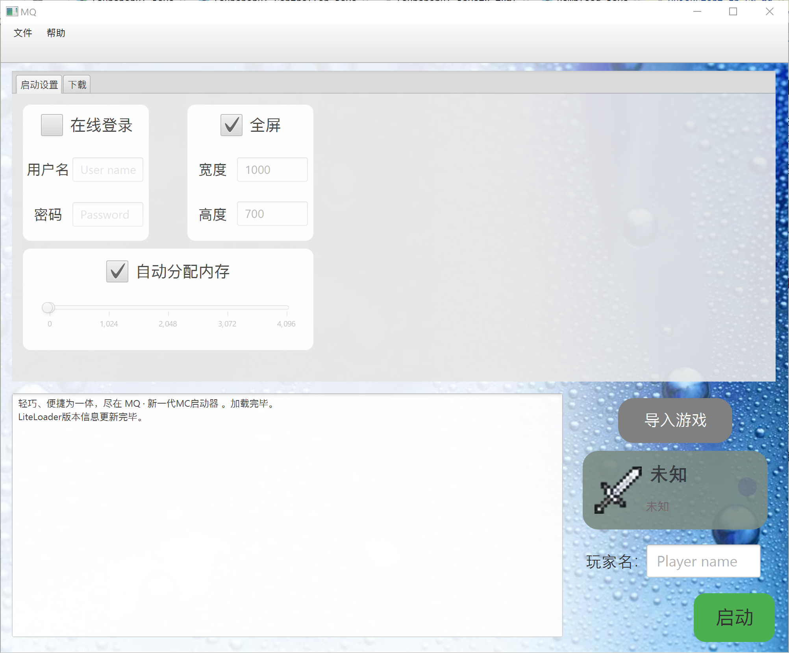

Lang : Eng | [简体中文](https://github.com/xiaoli8848/MQ/blob/main/README.zh_CN.md)

# MQ
A MC launcher based on [JMCCC](https://github.com/to2mbn/JMCCC).

## License

MQ is licensed under [the LGPL](LICENSE.txt).

(JMCCC is licensed under [the MIT license](https://to2mbn.github.io/jmccc/LICENSE.txt).)

## Features

- Launch all versions of Minecraft
- Downloads all versions of Minecraft
- Uses the com.Sparrow.UI by JavaFX to launch (or download) the different versions of Minecraft.

## Postscript

Here are very few core developers on this project, but the amount of work is not small, so we really hope that you can contribute to this project at any time, such as developing some FEAT and then creating Pull Request after fork.

