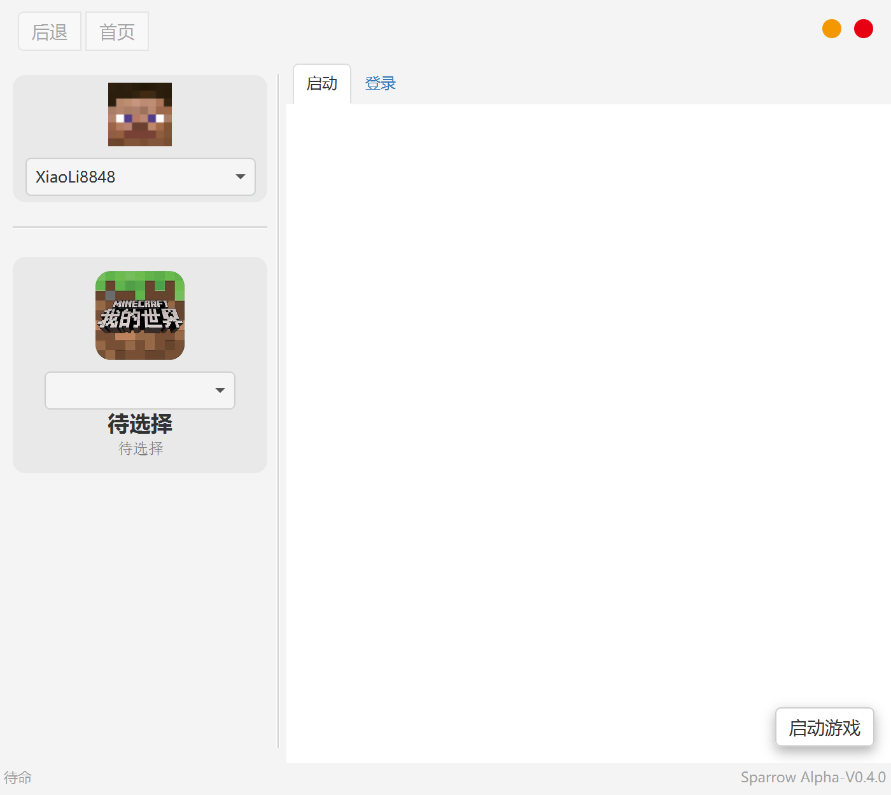

# Sparrow
基于 [JMCCC](https://github.com/to2mbn/JMCCC) 的Minecraft启动器

## License

本项目采用协议 [LGPL](LICENSE.txt).

（JMCCC使用协议 [MIT license](https://to2mbn.github.io/jmccc/LICENSE.txt)）

## Features

- 能够启动所有版本的 Minecraft Java版 客户端。

- 下载并自动安装任何版本的 Minecraft Java版 客户端。

- 使用JavaFX实现可视化界面交互。

## 后记

本项目是基于一个我感兴趣的接口[JMCCC](https://github.com/to2mbn/JMCCC)，制作的Minecraft游戏启动器，主要是学习目的，在制作过程中不断摸索在Java上的GUI实现、项目管理。

如果你有兴趣，非常欢迎为本项目进行指导，提出一些宝贵意见。你完全可以在遵守本项目的开源协议的前提下随意搞一搞这个项目。

作者时间不多，一周会开发一两次，所以请勿见怪。

